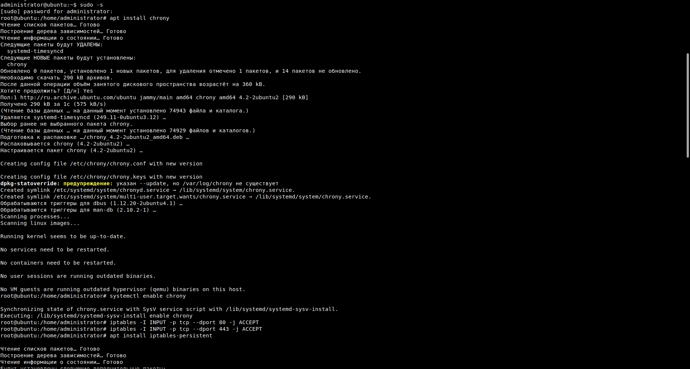
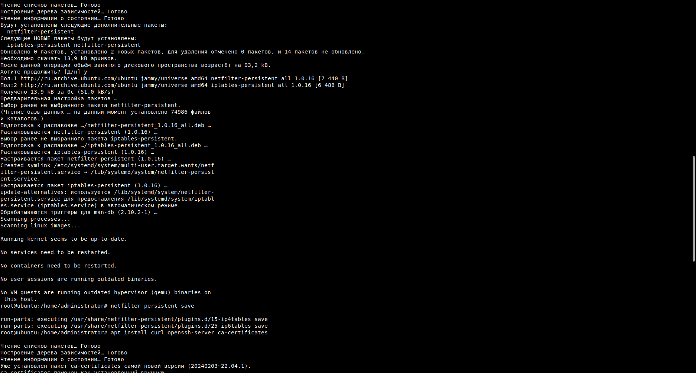
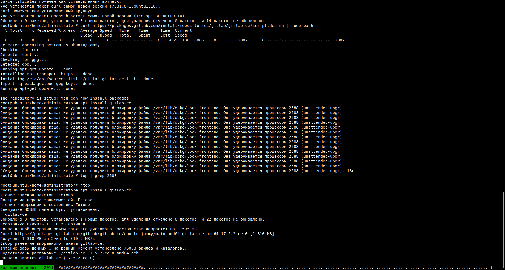
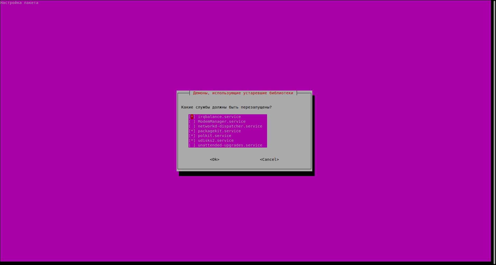
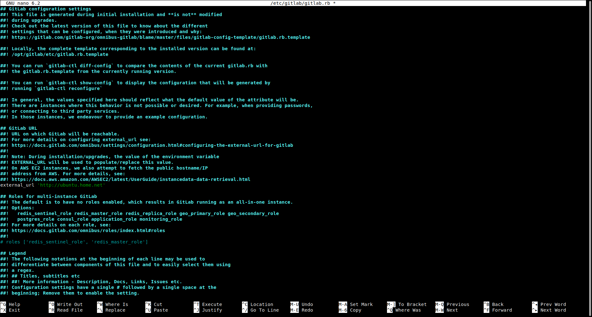
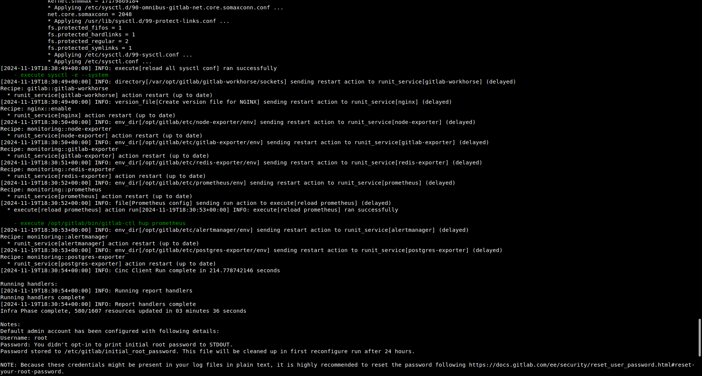
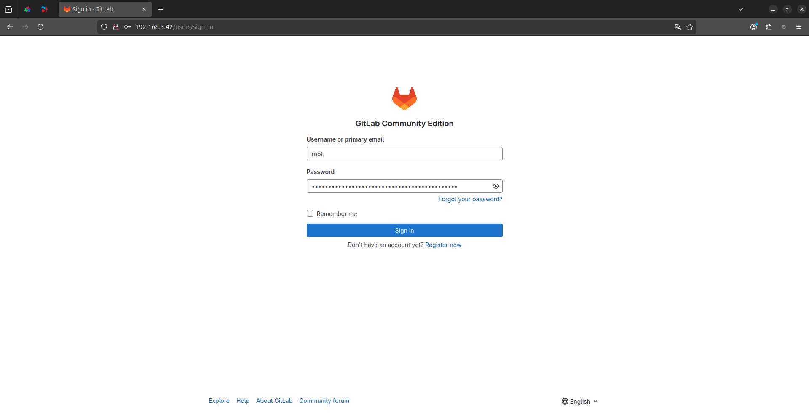
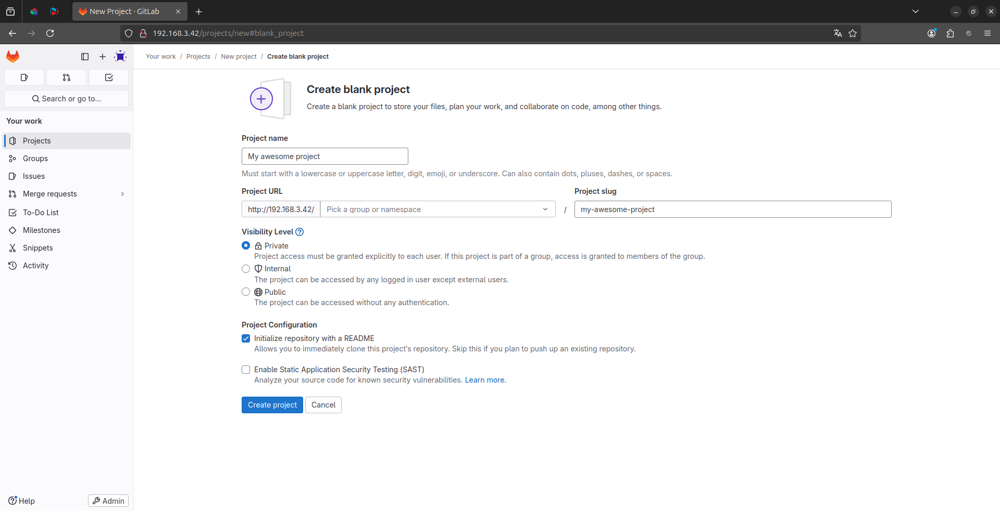
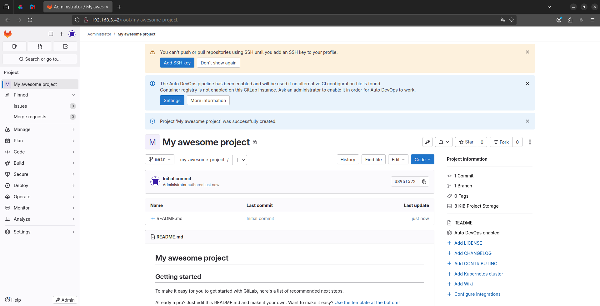

# DevSecOps_Homework_3

## Ход выполнения ДЗ
Для выполнения ДЗ использовались инструкции, описанные в статье [Установка веб-инструмента GitLab на Linux Ubuntu Server](https://www.markdownguide.org/basic-syntax/ "").

Скриншооты экрана при установке GitLab CE:

Установка chrony и добавление сетевых правил

Получение и установка GitLab CE

Перезапуск служб

Задаём external_url для сервера

Запускаем переконфигурирование сервера

Страница логона

Создаём проект

Страница проекта